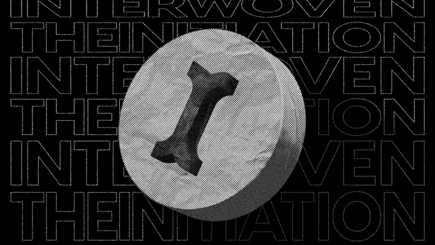

# 🌐 Introduction

**Initia** is a network of interconnected modular rollups. 

The **Initia Layer 1 (L1)** architecture is meticulously crafted using the powerful **Cosmos SDK**, with **CometBFT** (formerly known as Tendermint). Additionally, the integration of the **Move VM** supercharges smart contract capabilities. 🤖✨

This combination establishes Initia’s L1 as a robust, permissionless, and highly versatile smart contracting platform, providing a rock-solid foundation for all future infrastructure and data management. 🛠️🔗

### Useful Links 🔗

- [Website](https://initia.xyz/) 🌐
- [Docs](https://docs.initia.xyz/) 📚
